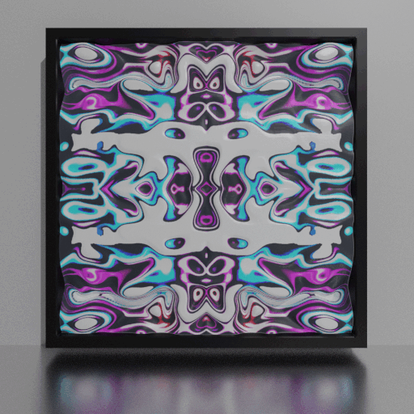

# 3D Abstract Frames

## [View the NFT collection](https://opensea.io/collection/3d-af)

Each NFT comes with a metaverse compatible 3D model. The frames are double-sided with a 3D mesh on one side and a flat version of the texture on the other.

View the model in augmented reality (AR) using the [Galeri](https://www.galeri.co/) app on iOS.

